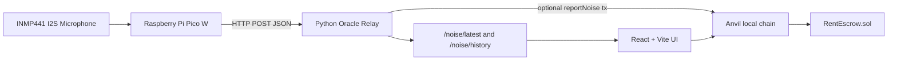

# DePIN Rental Noise Governance System

This project connects a Raspberry Pi Pico W noise sensor to a local Web3 rental escrow demo. The Pico W reads an INMP441 I2S microphone, sends noise telemetry to a Python oracle relay, and the relay can optionally submit verified violations to the local Anvil smart contract.

## What changed in this version

### Smart contract — Quadratic Voting

- `vote()` now accepts a `voteCount` parameter (1–3). Casting `n` votes costs `n²` voice credits.
- Each voter has `VOICE_CREDITS = 9` per proposal, enforced on-chain.
- `yesVotes` and `noVotes` in `Proposal` now accumulate vote-unit sums rather than voter counts.
- The win condition changed from a 60 % threshold to `yesVotes > noVotes`.
- `Proposal` gained a `voterCount` field so early execution still triggers when every eligible voter has cast a ballot, even if one voter cast more than one unit.
- A separate `creditsUsed[proposalId][voter]` mapping records how many credits each voter has spent on a proposal.
- Two new custom errors were added: `InvalidVoteCount` (zero or cost exceeds `VOICE_CREDITS`) and `InsufficientCredits`.
- `VoteCast` event now includes `voteCount`.
- Seven new Forge tests cover QV semantics: credit accounting, vote-unit accumulation, win/loss by unit total, and early-execution behavior.

### Frontend — component architecture

- `App.jsx` was split into four focused components under `frontend/src/components/`:
  - `Dashboard.jsx` — landlord-only system overview (room cards, contract constants, Event Log).
  - `MockControl.jsx` — live dB chart and manual noise-trigger panel.
  - `DAOPanel.jsx` — DAO proposal list with Quadratic Voting slider.
  - `AdminPanel.jsx` — tenant registration, deposit, and noise trigger (landlord only).
  - `MyRoom.jsx` — tenant-facing room summary and inline appeal form.

### Frontend — role-based tabs

- Four tabs replace the previous three: **我的房間**, **DAO 投票**, **系統總覽**, **管理**.
- After wallet connection the app reads `contract.landlord()`, `isTenant()`, and `addressToRoom()` to detect the connected account's role and auto-navigates to the appropriate tab.
- **系統總覽** and **管理** reject non-landlord accounts with an in-page message instead of hiding the tab.
- **我的房間** shows the tenant's room balance, locked amount, and their personal violation history. Each unappealed violation has an inline appeal form that pre-fills the violation ID.
- The noise-trigger panel moved from the dashboard into **管理**.
- All error messages are plain Chinese; raw `e.message` and `e.reason` values are never shown.
- No emoji appears in any tab label or static page content.

### Frontend — Quadratic Voting UI

- The approve/reject buttons in **DAO 投票** are preceded by a range slider (1–3 votes).
- The slider label updates live to show how many credits the selected vote count will cost (`n²`).
- Remaining credits for the connected account are fetched via `creditsUsed()` and displayed next to the slider.
- After voting, the card switches to a "已投票（花費 N credits）" state.

### Contract ABI

- `frontend/src/contract.json` ABI updated to match the new contract interface: `VOICE_CREDITS`, `creditsUsed`, the updated `vote` signature, and the `voterCount` field in `proposals`.

### Previous changes (hardware)

- Pico W now supports the INMP441 microphone on I2S pins GP10/GP11/GP12.
- Pico W sends fast monitoring payloads every `0.1` seconds.
- Backend stores live sensor data and exposes it through `GET /noise/latest` and `GET /noise/history`.
- Frontend displays backend sensor data using `estimatedDb`, updates every `200ms`, and refreshes contract state after a backend on-chain submission.
- Short noise spikes are monitoring-only. A contract violation is sent only when the estimated dB is continuously at or above `75 dB` for `5` seconds.
- A standalone graph page was added at `hardware/noise_monitor.html`.

## Frontend notes

The frontend should display live sensor dB from `estimatedDb`, not only `decibels`.

`decibels` is the value the backend uses for contract/reporting logic. During normal monitoring, the Pico intentionally clamps `decibels` below the violation threshold so short spikes do not create penalties. The real live reading is still available as `estimatedDb`.

Important backend fields:

```json
{
  "roomIndex": 0,
  "roomLabel": "Room A",
  "decibels": 74,
  "estimatedDb": 92,
  "noiseLevel": 88,
  "rawPeakI2s": 123456,
  "durationSeconds": 0.1,
  "source": "inmp441",
  "eventType": "monitoring",
  "violationRequiredSeconds": 5,
  "reportAllowed": false,
  "onchain": {
    "submitted": false
  }
}
```

When `eventType` becomes `"violation"`, `reportAllowed` can become `true`, and the backend may submit `reportNoise(...)` to the smart contract if `ORACLE_SUBMIT_ONCHAIN=1`.

Useful frontend endpoints:

```text
GET  http://127.0.0.1:8000/health
GET  http://127.0.0.1:8000/noise/latest
GET  http://127.0.0.1:8000/noise/history
POST http://127.0.0.1:8000/noise/ingest
```

## Architecture



## Run the full local demo

Start Anvil:

```powershell
anvil
```

Deploy the contract and export the ABI/address to the frontend:

```powershell
$env:PRIVATE_KEY="<ANVIL_ACCOUNT_0_PRIVATE_KEY>"
forge script script/Deploy.s.sol --rpc-url http://127.0.0.1:8545 --broadcast
node go.cjs
```

Start the backend oracle relay:

```powershell
python -m pip install web3 eth-account
$env:ORACLE_SUBMIT_ONCHAIN="1"
$env:ORACLE_RPC_URL="http://127.0.0.1:8545"
python hardware\web3_oracle.py
```

Start the frontend:

```powershell
cd frontend
npm install
npm run dev
```

Open:

```text
http://127.0.0.1:5173/
```

MetaMask local network:

```text
RPC URL:  http://127.0.0.1:8545
Chain ID: 31337
```

## Pico W setup

Edit `hardware/pico_noise_sender.py` before copying it to the Pico W. Do not commit real Wi-Fi credentials.

```python
SSID = "YOUR_WIFI_NAME"
PASSWORD = "YOUR_WIFI_PASSWORD"
ORACLE_URL = "http://YOUR_WINDOWS_IP:8000/"
SENSOR_MODE = "inmp441"
```

`ORACLE_URL` must use the Windows computer's Wi-Fi/LAN IPv4 address, not `127.0.0.1`.

Run while Pico W is connected by USB:

```powershell
python -m mpremote connect COM3 run hardware/pico_noise_sender.py
```

Copy as `main.py` so it auto-runs after power-on:

```powershell
python -m mpremote connect COM3 fs cp hardware/pico_noise_sender.py :main.py
python -m mpremote connect COM3 reset
```

INMP441 wiring:

```text
INMP441 VDD -> Pico 3V3(OUT)
INMP441 GND -> Pico GND
INMP441 SCK -> Pico GP10
INMP441 WS  -> Pico GP11
INMP441 SD  -> Pico GP12
INMP441 L/R -> GND
```

## Live graph

Start `hardware/web3_oracle.py`, keep the Pico sending data, then open:

```text
hardware/noise_monitor.html
```

The page polls the backend every `100ms` and graphs `estimatedDb`, `decibels`, and `noiseLevel`.

## Testing without hardware

Start the backend:

```powershell
python hardware\web3_oracle.py
```

Send a simulated Pico payload:

```powershell
python hardware\send_sample_payload.py --room "Room A" --decibels 82
```

Check latest backend state:

```powershell
curl http://127.0.0.1:8000/noise/latest
```

## Repository hygiene

Do not commit:

- Real Wi-Fi SSID/password.
- Local Windows IP addresses.
- Anvil `broadcast/`, `cache/`, `out/`, or `logs/` changes created during local testing unless a specific deployment artifact is intentionally required.
