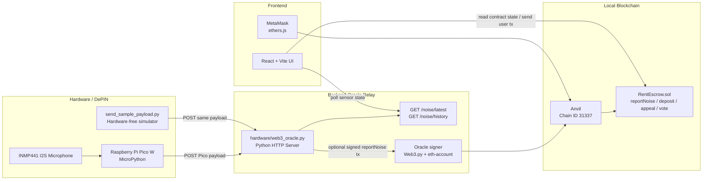
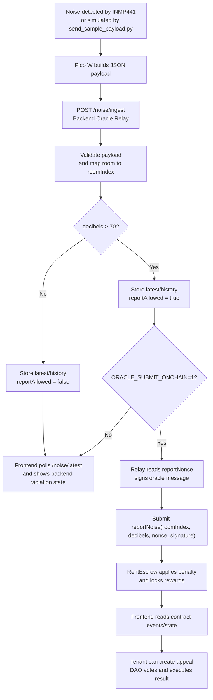

# 🏘️ DePIN Rental Noise Governance System

去中心化租屋噪音治理系統 — DePIN + DeFi + DAO

## 概述

解決分租公寓深夜噪音糾紛的 Web3 自治系統。透過 IoT 感測器客觀記錄分貝，智慧合約自動扣款補償，DAO 投票處理申訴。

## 系統架構

- **DePIN**：Raspberry Pi Pico W + INMP441 I2S 麥克風監聽噪音，透過 HTTP 傳送事件到後端 Oracle Relay
- **Backend Oracle Relay**：Python HTTP server 接收 Pico W payload，驗證/正規化資料，保留 latest/history 狀態，必要時簽章並送出 `reportNoise` 交易
- **DeFi**：RentEscrow 智慧合約管理保證金，自動扣款與 1/N 補償
- **DAO**：房客投票決定申訴是否成立，超過 60% 贊成則退款

## 技術架構圖



## Flow Chart



## 技術

| 層 | 技術 |
|----|------|
| 智慧合約 | Solidity, Foundry, Anvil |
| 前端 | React, Vite, ethers.js |
| Backend / Oracle | Python HTTP server, Web3.py / eth-account（on-chain 模式） |
| IoT | Raspberry Pi Pico W, MicroPython, INMP441 I2S microphone |

## 快速開始

### 1. 啟動本地鏈

```bash
anvil
```

### 2. 部署合約

```bash
PRIVATE_KEY=0xac0974bec39a17e36ba4a6b4d238ff944bacb478cbed5efcae784d7bf4f2ff80 \
forge script script/Deploy.s.sol --rpc-url http://127.0.0.1:8545 --broadcast
```

### 3. 更新合約地址

把部署出來的地址與 ABI 寫入 `frontend/src/contract.json`：

```bash
node go.cjs
```

### 4. 啟動前端

```bash
cd frontend
npm install
npm run dev
```

### 5. 啟動 Backend Oracle Relay

Relay 會接收 Pico W 傳來的 JSON，也提供 `GET /noise/latest` 和 `GET /noise/history` 給前後端整合測試。

```bash
python3 hardware/web3_oracle.py
```

沒有硬體時，可以用同樣格式的 payload 模擬 Pico W：

```bash
python3 hardware/send_sample_payload.py --room "Room A" --decibels 82
curl http://127.0.0.1:8000/noise/latest
```

若要讓 Relay 直接送出 oracle-signed `reportNoise` 交易到本地鏈：

```bash
pip install web3 eth-account
ORACLE_SUBMIT_ONCHAIN=1 ORACLE_RPC_URL=http://127.0.0.1:8545 python3 hardware/web3_oracle.py
```

### Frontend 測試方式（不需要硬體）

負責前端的人不需要 Pico W 或 INMP441 就可以測試硬體資料流程。測試時把 `hardware/send_sample_payload.py` 當成假的 Pico W，它送出的 JSON 格式會和真實 Pico W 一樣。

測試流程：

1. 啟動 Backend Oracle Relay：

```bash
python3 hardware/web3_oracle.py
```

2. 另一個 terminal 送出一筆假的 Pico W 噪音資料：

```bash
python3 hardware/send_sample_payload.py --room "Room A" --decibels 82
```

3. 前端讀取 latest sensor state：

```bash
curl http://127.0.0.1:8000/noise/latest
```

前端可以直接 poll 這個 API：

```js
const res = await fetch("http://127.0.0.1:8000/noise/latest");
const json = await res.json();
console.log(json.data);
```

回傳格式範例：

```json
{
  "status": "success",
  "data": {
    "deviceId": "pico-w-001",
    "roomIndex": 0,
    "roomLabel": "Room A",
    "decibels": 82,
    "durationSeconds": 5,
    "source": "simulation",
    "reportAllowed": true,
    "reason": "above threshold"
  }
}
```

前端需要看的主要欄位：

- `roomIndex`：合約使用的房間 index，`0` 到 `4`
- `roomLabel`：顯示用房間名稱，例如 `Room A`
- `decibels`：目前偵測到的分貝
- `source`：`simulation` 代表測試 payload，`inmp441` 代表真實麥克風 payload
- `reportAllowed`：是否超過噪音門檻，可用來決定 UI 是否顯示違規狀態
- `reason`：判斷原因，例如 `above threshold`

可用 API：

```text
GET  http://127.0.0.1:8000/health
GET  http://127.0.0.1:8000/noise/latest
GET  http://127.0.0.1:8000/noise/history
POST http://127.0.0.1:8000/noise/ingest
```

### 6. Pico W / INMP441 設定

在 `hardware/pico_noise_sender.py` 設定 Wi-Fi 與後端位置。使用真實 Pico W 時，`ORACLE_URL` 要填 Windows 電腦的區網 IPv4，不要填 `127.0.0.1`：

```python
SSID = "YOUR_WIFI_NAME"
PASSWORD = "YOUR_WIFI_PASSWORD"
ORACLE_URL = "http://YOUR_WINDOWS_IP:8000/"
```

沒有接麥克風時維持：

```python
SENSOR_MODE = "simulation"
```

接上 INMP441 後改成：

```python
SENSOR_MODE = "inmp441"
```

預設接線：

```text
INMP441 VDD -> Pico 3V3(OUT)
INMP441 GND -> Pico GND
INMP441 SCK -> Pico GP10
INMP441 WS  -> Pico GP11
INMP441 SD  -> Pico GP12
INMP441 L/R -> GND
```

### Windows + 真實 Pico W 測試方式

1. 在 Windows 找出 Wi-Fi IPv4：

```powershell
ipconfig
```

找 `Wireless LAN adapter Wi-Fi` 下面的 `IPv4 Address`，例如：

```text
192.168.1.50
```

2. 修改 `hardware/pico_noise_sender.py`：

```python
SSID = "your_wifi_name"
PASSWORD = "your_wifi_password"
ORACLE_URL = "http://192.168.1.50:8000/"
SENSOR_MODE = "inmp441"
```

3. 在 Windows 啟動 backend relay：

```powershell
cd path\to\blockchainProject
python -m pip install web3 eth-account
$env:ORACLE_SUBMIT_ONCHAIN="1"
$env:ORACLE_RPC_URL="http://127.0.0.1:8545"
python hardware\web3_oracle.py
```

4. 如果 Pico W 連不到 backend，確認 Windows 防火牆允許 Python 接收 port `8000` 的連線。

5. 將程式跑在 Pico W 上：

```powershell
python -m mpremote connect COM3 run hardware/pico_noise_sender.py
```

如果 COM port 不同，先在 Windows 裝置管理員確認 Pico W 的實際 COM port。

6. 確認 backend 收到真實麥克風資料：

```powershell
curl http://127.0.0.1:8000/noise/latest
```

成功時應該看到：

```json
"source": "inmp441"
```

7. 確認穩定後，可以把程式寫進 Pico W 開機自動執行：

```powershell
python -m mpremote connect COM3 fs cp hardware/pico_noise_sender.py :main.py
python -m mpremote connect COM3 reset
```

### 7. MetaMask 設定

新增 Anvil 本地網路：
- RPC URL：`http://127.0.0.1:8545`
- Chain ID：`31337`

匯入測試帳號（Anvil Account #0，Landlord）：
```
0xac0974bec39a17e36ba4a6b4d238ff944bacb478cbed5efcae784d7bf4f2ff80
```

## 角色說明

| 角色 | Anvil 帳號 | 說明 |
|------|-----------|------|
| Landlord | Account #0 | 部署者，負責登記房客 |
| Oracle | Account #1 | 感測器簽章帳號（不需匯入 MetaMask）|
| 房客 | Account #2 以後 | 需登記並存入保證金 |

## Demo 流程

1. Landlord 登記房客（管理頁）
2. 各房客存入保證金（≥ 0.4 ETH）
3. Pico W + INMP441 偵測噪音，或用 `send_sample_payload.py` 模擬同樣 payload
4. Backend Oracle Relay 接收 payload，轉成 room index / decibels，並可送出 `reportNoise`
5. 合約自動扣款，補償金先鎖定到其他房客帳戶
6. 被扣款者可發起 DAO 申訴，其他人投票決定
7. `結案` 原則上在 24 小時投票期後執行；如果所有 eligible voters 都已投票，也可以提前結案

## 專案結構

```
├── src/                  # Solidity 合約
│   └── RentEscrow.sol
├── test/                 # Foundry 測試
├── script/               # 部署腳本
├── frontend/             # React 前端
│   └── src/
│       ├── App.jsx
│       ├── web3.js
│       └── contract.json
└── hardware/             # Pico W / INMP441 / Backend Oracle Relay
    ├── pico_noise_sender.py
    ├── web3_oracle.py
    ├── send_sample_payload.py
    └── README.md
```
