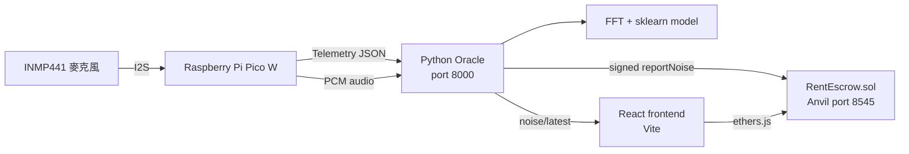

# DePIN 租屋噪音治理系統

本專案是一個結合 **IoT 噪音感測、區塊鏈押金管理與 DAO 申訴投票**的租屋治理 Prototype。

Raspberry Pi Pico W 透過 INMP441 麥克風取得噪音資料，將資料送到 Python Oracle。Oracle 提供即時資料給 React frontend，並可簽署交易呼叫 `RentEscrow.sol`。房客若不同意噪音罰款，可提出申訴，再由房東與其他房客使用 Quadratic Voting 決定結果。

> 目前狀態：各模組已完成主要功能與個別測試，正在進行實體硬體、Oracle backend 與 frontend 的最終端到端整合。

## 目錄
- [專案結構與架構](#專案結構與架構)
- [主要功能](#主要功能)
- [環境需求與準備工作](#環境需求與準備工作)
- [啟動專案](#啟動專案)
  - [使用 Launcher 啟動完整專案](#使用-launcher-啟動完整專案-推薦)
  - [手動啟動開發環境](#手動啟動開發環境-simulation--不使用硬體)
- [第一次使用 (設定與操作)](#第一次使用)
- [最短 Demo 流程](#最短-demo-流程)
- [合約規則摘要](#合約規則摘要)
- [目前進度與驗證狀態](#目前進度與驗證狀態)
- [重要限制](#重要限制)

## 專案結構與架構



系統有三條獨立路徑：

1. **Telemetry**：Pico 每 0.1 秒送出噪音讀值，frontend 每 200 ms 讀取 `/noise/latest`。
2. **Audio analysis**：Pico 上傳 PCM chunks，Oracle 儲存 WAV、計算 FFT，並執行 ML prediction。
3. **Blockchain**：符合條件的 telemetry 由 Oracle 簽章並呼叫 `reportNoise()`。

*(看到即時 dB 不代表已上鏈；看到 FFT 結果也不代表已產生罰款。)*

**專案資料夾說明：**
- `src/RentEscrow.sol`: 智慧合約
- `script/Deploy.s.sol`: Foundry 部署腳本
- `test/RentEscrow.t.sol`: 合約測試
- `frontend/`: React + Vite 應用程式
- `hardware/pico_noise_sender.py`: Pico W MicroPython 程式
- `hardware/web3_oracle.py`: Oracle、FFT/ML、WAV 儲存與區塊鏈中繼
- `hardware/README.md`: 詳細的硬體與後端指南
- `training_data/`: 打包的模型與中繼資料
- `start.sh` / `run_all.sh` / `run_all.ps1`: 啟動腳本

## 主要功能

### Smart Contract
- 最多五間房與房客登記
- 房客押金存入及提領
- 依累積違規次數計算三級罰款
- ECDSA Oracle 簽章及 nonce 防重放
- 多 Oracle 管理
- 五分鐘 Demo 申訴窗口
- Quadratic Voting，每人每案 9 credits
- 所有合資格投票者完成投票後可提前結案

### Frontend
- 整合 MetaMask 與 Anvil chain `31337`
- 房東、房客與訪客角色介面
- 建立公寓及房客管理
- 押金、違規與申訴操作
- DAO 投票及結案
- 即時顯示 Oracle 噪音資料
- Oracle 上鏈成功後重新載入合約狀態

### Hardware and Oracle
- Pico W + INMP441 I2S 整合
- 支援 Simulation 與 real microphone mode
- Telemetry、裝置 online 狀態與 JSONL event log
- 連續 PCM 錄音與 WAV 儲存
- FFT 頻譜頁面、手動 label collection 與 sklearn 噪音分類模型
- 機器學習信心指數（Confidence Tracking）與噪音平滑化過濾機制
- 選用的 Oracle 自動上鏈

完整硬體設定、API schema、接線、錄音及 FFT/ML 操作請閱讀 [`hardware/README.md`](hardware/README.md)。

## 環境需求與準備工作

- Foundry：`forge`、`anvil`
- Node.js 18+
- Python 3.10+
- MetaMask 瀏覽器擴充功能
- **(使用實體硬體)** Raspberry Pi Pico W 透過 USB 連接，並接上 INMP441 麥克風 *(不支援 Arduino 和 ESP32)*
- **(使用實體硬體)** Pico W 與執行此專案的電腦必須連接到同一個 Wi-Fi 網路

如果依賴尚未安裝，前端和 Python 的套件通常會在執行啟動腳本時自動安裝，或者也可以選擇手動安裝：

```bash
cd frontend
npm install
cd ..

python3 -m pip install \
  web3 eth-account numpy scikit-learn==1.9.0 joblib mpremote
```

## 啟動專案

啟動腳本 (`run_all.sh` 或 `run_with_setup.sh`) 會自動啟動 Anvil、部署 `RentEscrow` 合約、產生前端的合約 metadata、註冊第一位測試房客（Tenant）、啟動 Python Backend 以及 React 前端，最後設定一個暫時的 Pico W 腳本透過 `mpremote` 執行。

### 使用 Launcher 啟動完整專案 (推薦)

#### macOS / Linux

首先尋找 Pico 的序列埠 (Serial port)：
```bash
ls /dev/cu.usbmodem*
```

執行專案：
```bash
./run_all.sh --port /dev/cu.usbmodemXXXX --wifi-ssid "您的WIFI名稱" --wifi-password "您的WIFI密碼"
```

如果不想將密碼留在指令歷史紀錄中，可以使用環境變數：
```bash
PICO_WIFI_SSID="您的WIFI名稱" PICO_WIFI_PASSWORD="您的WIFI密碼" ./run_with_setup.sh --port /dev/cu.usbmodemXXXX
```

⚠️ **重要提示**：
1. 腳本執行後會開始瘋狂印出 Pico 的噪音資料（`Sending: {'device_id'...}`），**這是正常現象，請絕對不要按 `Ctrl+C` 中斷，否則伺服器與區塊鏈會被關閉！**
2. 腳本啟動後會自動彈出瀏覽器。你只需要點擊網頁上的「連接 MetaMask」，系統就會全自動幫你以 `FrankPepe`（房東）或 `Tenant`（房客）的身分登入，免除手動註冊。

#### Windows

```powershell
powershell -ExecutionPolicy Bypass -File .\run_all.ps1 -Port COM3 -WifiSsid "您的WIFI名稱" -WifiPassword "您的WIFI密碼"
```

使用環境變數的寫法：
```powershell
$env:PICO_WIFI_SSID = "您的WIFI名稱"; $env:PICO_WIFI_PASSWORD = "您的WIFI密碼"; powershell -ExecutionPolicy Bypass -File .\run_all.ps1 -Port COM3
```

*(提示：在 Windows 上可使用 `-HostIP` 或 macOS/Linux 上使用 `--host-ip` 手動指定 LAN IP，以防自動偵測選擇了錯誤的網卡。)*

### 相關服務 URLs
啟動完成後，各服務的網址如下：
- DePIN Frontend: `http://127.0.0.1:5173/` (或 Vite 提示的 URL)
- Anvil RPC: `http://127.0.0.1:8545`
- Oracle Backend Health: `http://127.0.0.1:8000/health`
- FFT Demo: `http://127.0.0.1:8000/fft_demo/`
- Instant Model Test: `http://127.0.0.1:8000/instant_noise_test/`

### 手動啟動開發環境 (Simulation / 不使用硬體)

若只想執行純軟體的模擬，可依序在多個獨立的終端機中執行：

** macOS / Linux (不含硬體)**
可直接使用 `start.sh`，它會啟動 Anvil、Oracle、與 Frontend：
```bash
bash start.sh
```

** Windows (不含硬體)**
使用四個 PowerShell 終端機：

```powershell
# Terminal 1: local blockchain
anvil
```

```powershell
# Terminal 2: build contract artifact
$env:PRIVATE_KEY = "0xac0974bec39a17e36ba4a6b4d238ff944bacb478cbed5efcae784d7bf4f2ff80"
forge script script/Deploy.s.sol --rpc-url http://127.0.0.1:8545 --broadcast
node go.cjs
```

```powershell
# Terminal 3: Oracle
$env:ORACLE_SUBMIT_ONCHAIN = "1"
$env:ORACLE_RPC_URL = "http://127.0.0.1:8545"
python hardware\web3_oracle.py
```

```powershell
# Terminal 4: Frontend
cd frontend
npm run dev
```

## 第一次使用

### MetaMask 網路設定
```text
Network name: Anvil Local
RPC URL:      http://127.0.0.1:8545
Chain ID:     31337
Currency:     ETH
```

開發用房東帳號是 Anvil Account #0：
```text
Address:     0xf39Fd6e51aad88F6F4ce6aB8827279cffFb92266
Private key: 0xac0974bec39a17e36ba4a6b4d238ff944bacb478cbed5efcae784d7bf4f2ff80
```
*(此帳號與 private key 僅可用於本機 Anvil 開發，切勿用於正式網路！)*

### App Setup 流程
1. 執行 `./run_with_setup.sh` 後，等待瀏覽器自動開啟。
2. 使用房東帳號 (`0xf39...`) 連接 MetaMask，系統將在背景自動將身分設定為 `FrankPepe` 並進入管理員畫面。
3. 若使用房客帳號 (`0x3C44...`) 連線，由於腳本已自動代為註冊及繳交押金，將會直接進入房客專屬畫面。
4. 設定完成後即可執行模擬流程或接上實體 Pico W 進行噪音測試。

## 最短 Demo 流程

### 1. 確認 Oracle
```bash
curl http://127.0.0.1:8000/health
```

### 2. 模擬 Pico Telemetry
```bash
python3 hardware/send_sample_payload.py --room "Room A" --decibels 82
curl http://127.0.0.1:8000/noise/latest
```
Frontend 應顯示 Room A 的新讀值。若 Oracle 自動上鏈已啟用，而且房客與押金狀態正確，response 的 `onchain.submitted` 應為 `true`。

### 3. 模擬 PCM / FFT
```bash
python3 hardware/send_sample_audio.py \
  --room-id "Room A" \
  --duration-ms 250 \
  --violation
```
開啟：`http://127.0.0.1:8000/fft_demo/`

### 4. 實體 Pico W (非自動 Launcher 模式)
若非透過 `run_all` 自動載入，需先將 `hardware/pico_noise_sender.py` 的三個 URL 改成 Oracle 電腦的 LAN IP (例如 `192.168.1.50`):
```python
ORACLE_URL = "http://192.168.1.50:8000/noise/ingest"
AUDIO_UPLOAD_URL = "http://192.168.1.50:8000/api/audio/upload"
MIC_TEST_UPLOAD_URL = "http://192.168.1.50:8000/api/mic-test/upload"
```
再執行連線：
```powershell
python -m mpremote connect COM3 run hardware\pico_noise_sender.py
```
驗證裝置狀態：
```bash
curl http://127.0.0.1:8000/devices
```

### Demo 完成標準
- `/health` 回傳 `status: ok` 且 `lastError` 為 `null`
- `/devices` 顯示 `pico-w-001` online
- Frontend 顯示 `source: inmp441` 的真實讀值
- FFT 頁面能隨 PCM upload 更新
- Frontend 與 Oracle 使用同一份 runtime contract address
- 真實 Pico 事件產生 `onchain.submitted: true`
- 合約出現 `NoiseReported` 與 `PenaltyApplied` 事件
- Frontend 顯示更新後的押金與違規次數

## 合約規則摘要

| 規則 | 目前設定 |
|------|----------|
| Contract noise threshold | `> 70 dB` |
| Pico sustained threshold | `>= 75`，持續 5 秒 |
| 第 1–5 次罰款 | `0.001 ETH` |
| 第 6–10 次罰款 | `0.002 ETH` |
| 第 11 次以上罰款 | `0.004 ETH` |
| 申訴窗口 | 5 分鐘，Demo 設定 |
| 申訴費用 | `0.01 ETH` |
| Voice credits | 每人每案 9 credits |
| 最低 quorum | 3 個投票單位 |

目前 Oracle relay 只有在 `peak_decibel > 75` 並且機器學習辨識結果為 `human_created_noise` 時允許自動上鏈。因此目前實際硬體流程的有效門檻是高於 75；contract 本身仍接受任何高於 70 的有效 Oracle 報告。

## 目前進度與驗證狀態

最後更新：2026-06-13

| 模組 | 狀態 | 目前成果 |
|------|------|----------|
| Smart contract | 已完成 | 押金、累進罰款、申訴、Quadratic Voting、多 Oracle、nonce 防重放 |
| Contract tests | 已完成 | Foundry 共 50 個 tests 通過 |
| Frontend | 已完成主要功能 | 房東、房客與訪客介面；MetaMask；即時噪音 polling；自動註冊身分；合約操作 |
| Oracle backend | 已完成主要功能 | Telemetry API、簽章上鏈、WAV、FFT、ML prediction、噪音類別平滑化（Confidence Smoothing） |
| Hardware code | 已完成 | Pico W Wi-Fi、INMP441 I2S、telemetry、連續 PCM 錄音與 upload |
| Hardware-free simulation | 已驗證 | 可用 Python scripts 模擬 Pico telemetry 與 PCM audio |
| FFT / ML demo | 已驗證 | FFT 頻譜、手動標記、sklearn model loading 與 prediction |
| 三方端到端整合 | 已完成 | 由實體 Pico W 經 Oracle 上鏈，並於 frontend 同步更新狀態（[已錄製 Demo 影片 `0610(1)`](assets/0610(1).mp4)） |

**已通過的驗證項目：**
- `forge test`: 50 passed
- `cd frontend && npm run build`: passed
- Python hardware scripts compile: passed
- Telemetry API smoke test: passed
- FFT/ML API smoke test: passed
- 使用實體 Pico W + INMP441 完成最終端到端驗收與錄影

**尚未完成：**
- 依真實聲級計校正 `estimated_db`；目前數值不是正式 dB SPL
- 確認長時間錄音、Wi-Fi 斷線與重新連線的穩定性
- 用不同房間、距離與背景聲擴充 ML dataset
- 正式環境需移除開發用 Wi-Fi 資訊及 Anvil private key
- Oracle 目前信任 Pico 傳入的持續時間；production 前應增加 backend 端驗證

## 重要限制
- `estimated_db` 尚未以正式聲級計校正。
- FFT rule 與 ML model 是 Prototype，不可視為可靠的聲音鑑識結果。
- `mic_test_audio/` 會儲存原始音訊，只能在取得同意的測試環境中啟用。
- Anvil 重啟後，舊 contract address 會失效，必須在 frontend 重新建立公寓。
- `frontend/src/contract.json` 儲存 ABI 與 bytecode，不是固定部署地址。
- Pico 必須使用 Oracle 電腦的 LAN IP，不能使用 `127.0.0.1`。
- Repository 中的開發用網路設定與 private key 不可用於 production。
