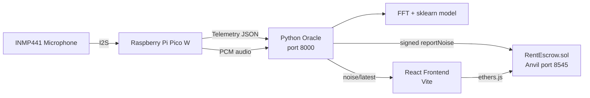

# DePIN Rental Noise Governance System

## Project Overview
This project demonstrates a **Decentralized Physical Infrastructure Network (DePIN)** use case for noise governance in rental housing.
- **Hardware**: Raspberry Pi Pico W with an INMP441 I2S microphone.
- **Backend**: Python Oracle (HTTP port 8000) collects noise telemetry, PCM audio, performs FFT and machine‑learning classification, and can sign and submit blockchain transactions.
- **Blockchain**: Deployed with Foundry and Anvil (local chain on port 31337) the `RentEscrow.sol` contract, which manages tenant deposits, fines, disputes, and DAO voting.
- **Frontend**: React + Vite interface that uses MetaMask for wallet interactions, providing real‑time dB charts, room management, fine handling, and voting UI.

**Goal**: Show a complete pipeline – IoT sensing → backend analysis → smart‑contract automated execution – suitable as a teaching example or prototype for DePIN applications.

## Architecture Diagram

The diagram illustrates three data paths:
1. **Telemetry** – a dB reading every 0.1 s is sent to the backend and displayed in the frontend chart.
2. **Audio Analysis** – PCM audio is uploaded, converted to WAV, processed with FFT, classified by an ML model, and the result is shown in the UI (no direct fine).
3. **On‑chain Reporting** – telemetry that meets fine criteria is signed by the Oracle and triggers `reportNoise()` on the contract.

## Requirements
| Item | Minimum version / Requirement |
|------|------------------------------|
| Foundry (forge, anvil) | `brew install foundry` (macOS) or see https://book.getfoundry.sh |
| Node.js | 18 or newer |
| Python | 3.10 or newer |
| MetaMask | Browser extension |
| Raspberry Pi Pico W | MicroPython firmware with `network`, `urequests`, `machine.I2S` support |
| INMP441 Microphone | Connected via I2S – see `hardware/README.md` for wiring |

If you only want to simulate locally, the hardware can be skipped and the telemetry simulation will be used.

## Quick Start
### 1. Install frontend and backend dependencies
```bash
# Frontend
cd frontend
npm install

# Backend (Python)
python3 -m pip install \
  mpremote numpy scikit-learn==1.9.0 joblib \
  web3 eth-account
```
### 2. Run the full demo (recommended)
```bash
# Identify the Pico serial port (macOS example)
ls /dev/cu.usbmodem*

# Export Wi‑Fi credentials as environment variables to avoid storing them in shell history
PICO_WIFI_SSID="YourWiFiSSID"
PICO_WIFI_PASSWORD="YourWiFiPassword"

# Execute the launch script – replace the port placeholder with the actual device path
./run_all.sh --port /dev/cu.usbmodemXXXX
```
The script will:
1. Start Anvil (local chain on port 31337).
2. Deploy `RentEscrow.sol` with Foundry and write the address to `frontend/src/contract.json`.
3. Launch the Python Oracle (`http://127.0.0.1:8000`).
4. Start the React frontend (automatically opens a browser).
5. Upload and run `pico_noise_sender.py` on the Pico, which begins sending noise telemetry.
> **Important**: The script continuously prints telemetry from the Pico. Do not interrupt with `Ctrl+C` unless you intend to stop all services.

### 3. Simulation only (no hardware)
```bash
# Start Anvil, Oracle, and frontend without the Pico
./run_all.sh --skip-pico
```
Or run the components manually:
```bash
anvil &
forge script script/Deploy.s.sol --rpc-url http://127.0.0.1:8545 --broadcast &
python hardware/web3_oracle.py &
cd frontend && npm run dev
```
Open the browser to view the live dB chart, room management, fine handling, and voting UI.

## Usage Guide
| Feature | How to use |
|---------|------------|
| Real‑time noise monitoring | The frontend polls `GET /noise/latest` every 200 ms to update the chart. |
| On‑chain fines | When telemetry meets fine thresholds, the Oracle calls `reportNoise()`. MetaMask will prompt you to sign the transaction. |
| Dispute workflow | Tenants click **File Dispute**, the contract locks the fine, and a DAO Quadratic Voting session opens. After voting ends, the contract automatically decides whether to cancel the fine. |
| Model prediction | After uploading PCM audio, the Oracle runs FFT → sklearn model → returns `confidence` and `noise_type`. |
| Hardware configuration | See `hardware/README.md` for Pico Wi‑Fi setup, GPIO, and I2S wiring instructions. |

## Contributing Guide
1. Fork this repository and work on the `main` branch.
2. Create a new branch: `git checkout -b feature/your-feature`.
3. Implement changes and ensure they pass tests:
   - Contracts: `forge test` (includes gas report).
   - Frontend: `npm run lint && npm run build`.
   - Oracle: add tests if needed and run `python -m pytest`.
4. Commit your work: `git add . && git commit -m "your concise message"`.
5. Push the branch: `git push origin feature/your-feature`.
6. Open a Pull Request describing the changes and testing methodology.

## License
This project is licensed under the MIT License. See the `LICENSE` file for details.